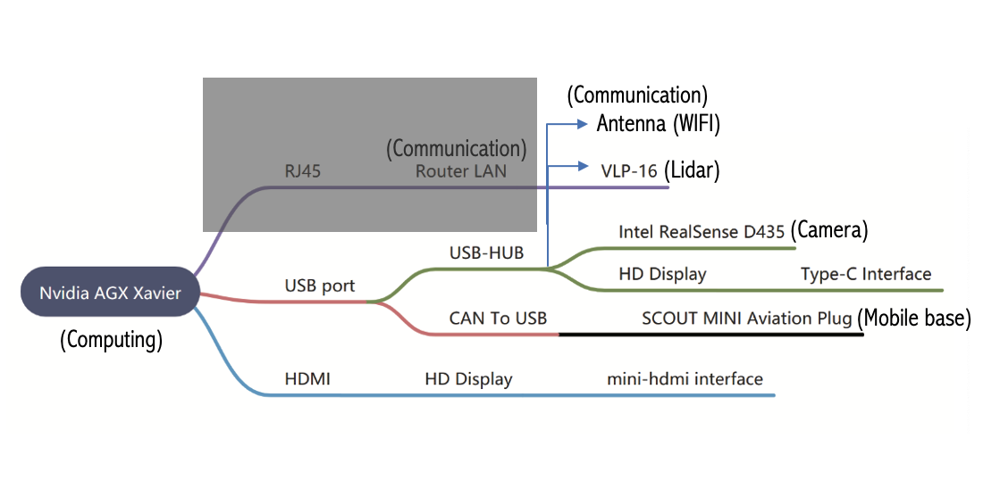

The code used in this project comes from the following sources:
 
 - ROS packages for Scout Mobile Robot: 
 https://github.com/agilexrobotics/scout_ros

 This packages have been modified to being used in this demo. The code is saved in the catkin folder of this respository.

Please note that the manual referenced in these instructions can be found [here](Documentation/user-guide-agilex-robotics-research-and-development-kit-fr.pdf)


# General information: 
1. The AgileX robot computer is ubuntu 18.04 running with ros melodic.
2. The following figure is the external connection of Nvidia Jetson Nano. I identified an issue with the router that
limited the connection to the robot. To address this, I modified the hardware setup by bypassing the router, and connecting
the lidar directly to the Nvidia Jetson Xavier unit. In addition, to maintain both internet connectivity and communication
with the lidar I changed the IP address in the Velodyne configuration.




## How do you connect to the robot?

### Option 1 - Remote Desktop
1. Download [NoMachine](https://www.nomachine.com/es) in your computer.
2. Make sure that your computer and the robot computer are in the same WIFI network.
3. Configure the AgileX computer as a new connection.
     - Username:agilex
     - Password:agx
  
### Option 2 - Connect to the robot using SSH
ssh agilex@10.204.79.114
ifconfig --> inet flag
- To activate open a window in the remote machine export DISPLAY=:0
Reference: https://askubuntu.com/questions/405916/open-a-window-in-a-remote-machine

## Teleoperation

To set up teleoperation, you'll need to use two terminal windows.

### Terminal 1:
1. Navigate to your workspace:
   ```bash
   cd ~/catkin_ws
   ```
2. Source the setup file:
   ```bash
   source devel/setup.bash
   ```
3. Set up the CAN interface and launch the robot base:
   ```bash
   sudo ip link set can0 up type can bitrate 500000
   roslaunch scout_bringup scout_robot_base.launch
   ```

### Terminal 2:
1. Navigate to your workspace:
   ```bash
   cd ~/catkin_ws
   ```
2. Source the setup file:
   ```bash
   source devel/setup.bash
   ```
3. Launch the teleoperation keyboard interface:
   ```bash
   roslaunch scout_bringup scout_teleop_keyboard.launch
   ```

**Note:** Make sure to switch the handle to command control mode (SWB at the top) on the remote control. The control mode switching button (SWB) positions are as follows:
- **Top:** Command mode
- **Middle:** Remote control mode
- **Bottom:** Constant speed mode


## Autonomous navigation

First we need to map the area following the manual instructions (I have already done this).

### Terminal 1:
(1) Start the lidar and publish the coordinate transformation of base_link-><laser_link>
```bash
roslaunch scout_bringup open_rslidar.launch
```
### Terminal 2:
（2）Start move_base navigation:
```bash
roslaunch scout_bringup navigation_4wd.launch
```


## Manuals:
1. AgileX Scout Mini manuals:
   - https://static.generation-robots.com/media/user-guide-agilex-robotics-research-and-development-kit-fr.pdf
   - https://agilexrobotics.gitbook.io/scout-mini-lite-and-pro/3-development-guide#id-3.7-navigation-and-positioning-based-on-gmapping-open-source-architecture


